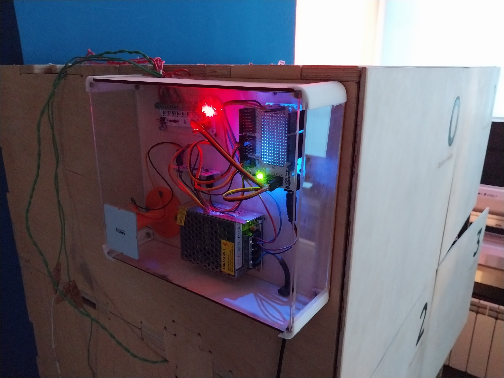

# FabLockers

Personal RFID-lockers for students of Digital Fabrication Master's Program.

Libraries to be installed in Arduino IDE:

1. [AmperkaFET](https://github.com/amperka/AmperkaFET)
2. [Adafruit-PN532](https://github.com/adafruit/Adafruit-PN532)

